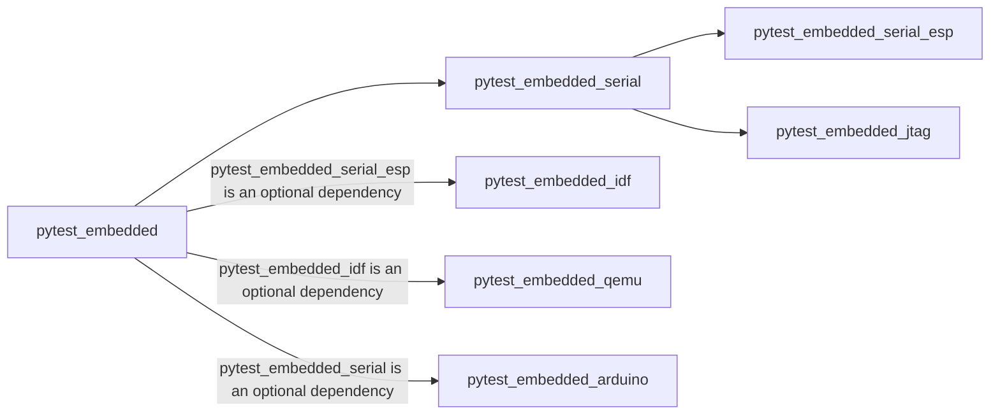

# Services

## Fixtures

- `test_file_path`

    Current test script file path

- `test_case_name`

    Current test case function name

- `test_case_tempdir`
  
    Temp directory for each test case.
    The pexpect process log and the generated junit report (if possible) would be placed under this folder.

- `pexpect_proc`

    Pre-initialized pexpect process, used for initializing all fixtures who would redirect output

- `redirect`

    Provided a context manager that could help print all the `sys.stdout` with timestamp and redirect `sys.stdout` 
    to `dut.pexpect_proc`.

    ```python
    with redirect():
        print('this should be logged and sent to pexpect_proc')
    ```

- `app`

    A pytest fixture to gather information from the specified built binary folder

- `serial`

    A serial subprocess that could read/redirect/write

- `openocd`

    A openocd subprocess that could read/redirect/write

- `gdb`

    A gdb subprocess that could read/redirect/write

- `qemu`

    A qemu subprocess that could read/redirect/write

- `dut`

    A DUT object that could gather output from various sources and redirect them to the pexpect process, and run `expect()` via its pexpect process.

## CLI Options

```shell
embedded:
  --count=COUNT         Use this argument when you need multi DUTs in one test case. e.g., master-slave, or mesh.
                        All fixtures would be tuples of instances when this value is more than 1. (Default: 1)
                        Notes:
                        This value should be an integer greater or equal to 1.
                        Use separator "|" for all the other cli options when using different configurations for each DUT.
                        For example:
                        "--embedded-services=esp,idf|esp" for one idf related app and one other type of app.
                        "--app-path=test_path1|test_path2" when two DUTs are using different built binary files.
                        "--part-tool=part_tool_path|" when only the first DUT needs this option, the second should keep as empty.
                        "--embedded-services=idf --count=2" when both of these DUTs are using the same services.
                        The configuration would be duplicated when it has only one value but the "count" amount is greater than 1. It would raise an exception when the
                        configuration has multi values but the amount is different from the "count" amount.
                        For example:
                        "--embedded-services=idf|esp-idf --count=3" would raise an exception.
  --parallel-count=PARALLEL_COUNT
                        Number of parallel build jobs. (Default: 1)
  --parallel-index=PARALLEL_INDEX
                        Index (1-based) of the job, out of the number specified by --parallel-count. (Default: 1)
  --embedded-services=EMBEDDED_SERVICES
                        Activate comma-separated services for different functionalities. (Default: "")
                        Available services:
                        - serial: open serial port
                        - esp: auto-detect target/port by esptool
                        - idf: auto-detect more app info with idf specific rules, auto flash-in
                        - jtag: openocd and gdb
                        - qemu: use qemu simulator instead of the real target
                        - arduino: auto-detect more app info with arduino specific rules, auto flash-in
                        All the related CLI options are under the groups named by "embedded-<service>"
  --app-path=APP_PATH   App path
  --build-dir=BUILD_DIR
                        build directory under the app_path. (Default: "build")
  --with-timestamp=WITH_TIMESTAMP
                        y/yes/true for True and n/no/false for False. Set to True to enable print with timestamp. (Default: True)
  --reorder-by-app-path
                        Reorder the test sequence according to the [app_path] and [build_dir]. (Default: False)

embedded-serial:
  --port=PORT           serial port. (Env: "ESPPORT" if service "esp" specified, Default: "None")
  --baud=BAUD           serial port communication baud rate. (Default: 115200)

embedded-esp:
  --target=TARGET       serial target chip type. (Default: "auto")
  --skip-autoflash=SKIP_AUTOFLASH
                        y/yes/true for True and n/no/false for False. Set to True to disable auto flash. (Default: False)
  --erase-all=ERASE_ALL
                        y/yes/true for True and n/no/false for False. Set to True to erase all flash before programming. (Default: False)
  --esptool-baud=ESPTOOL_BAUD
                        esptool flashing baud rate. (Env: "ESPBAUD" if service "esp" specified, Default: 921600)

embedded-idf:
  --part-tool=PART_TOOL
                        Partition tool path, used for parsing partition table. (Default: "$IDF_PATH/components/partition_table/gen_esp32part.py"
  --confirm-target-elf-sha256=CONFIRM_TARGET_ELF_SHA256
                        y/yes/true for True and n/no/false for False. Set to True to read the elf sha256 from target flash and compare to the local elf under
                        app.binary_path when session target-app cache decide to skip the autoflash. (Default: False)
  --erase-nvs=ERASE_NVS
                        y/yes/true for True and n/no/false for False. Set to True to erase the non-volatile storage blocks when flash files to the target chip. Requires
                        valid partition tool. (Default: False)
  --skip-check-coredump=SKIP_CHECK_COREDUMP
                        y/yes/true for True and n/no/false for False. Set to True to skip auto check core dump in UART/flash while teardown the failing test case. Requires
                        valid partition tool, project_description.json under the build dir. (Default: False)

embedded-jtag:
  --gdb-prog-path=GDB_PROG_PATH
                        GDB program path. (Default: "xtensa-esp32-elf-gdb")
  --gdb-cli-args=GDB_CLI_ARGS
                        GDB cli arguments. (Default: "--nx --quiet --interpreter=mi2"
  --openocd-prog-path=OPENOCD_PROG_PATH
                        openocd program path. (Default: "openocd")
  --openocd-cli-args=OPENOCD_CLI_ARGS
                        openocd cli arguments. (Default: "f board/esp32-wrover-kit-3.3v.cfg -d2")

embedded-qemu:
  --qemu-image-path=QEMU_IMAGE_PATH
                        QEMU image path. (Default: "<app_path>/flash_image.bin")
  --qemu-prog-path=QEMU_PROG_PATH
                        QEMU program path. (Default: "qemu-system-xtensa")
  --qemu-cli-args=QEMU_CLI_ARGS
                        QEMU cli default arguments. (Default: "-nographic -no-reboot -machine esp32")
  --qemu-extra-args=QEMU_EXTRA_ARGS
                        QEMU cli extra arguments, will append to the argument list. (Default: None)
  --skip-regenerate-image=SKIP_REGENERATE_IMAGE
                        y/yes/true for True and n/no/false for False. Set to True to disable auto regenerate image. (Default: False)
```

## Services

Activate a service would enable a set of fixtures or add some extra functionalities to a few fixtures.

--8<-- "pytest-embedded-serial/README.md"

--8<-- "pytest-embedded-serial-esp/README.md"

--8<-- "pytest-embedded-idf/README.md"

--8<-- "pytest-embedded-jtag/README.md"

--8<-- "pytest-embedded-qemu/README.md"

--8<-- "pytest-embedded-arduino/README.md"

## Dependency Graph



--8<-- "docs/abbr.md"
